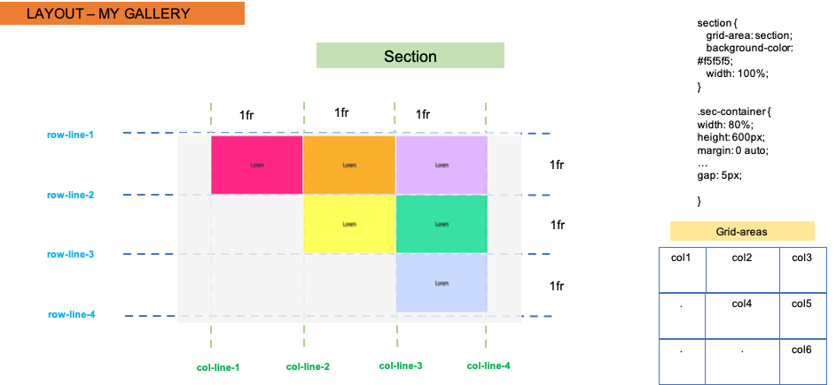

# Grid Document Layout

#### Insructions
- Using CSS Grid (and Flexbox if you like) recreate the reference layout below.
- Work in the existing `index.html` file
### Images
- You will find all immages in the `images` folder

### Hints
- Use `grid-template-columns`, `grid-template-rows` and `grid-template-areas`to create the layout.
- Use `grid-gap` for the margins between colimns and rows.

## Layout designs

### Make use of the images and information below to come to the best solution -

- The whole document

- Main section

- Second part

- Footer

## The online version

In order to see live version, just [click...!](https://hsnakk.github.io/UIB_Layout_Grid_Exercise-1/)

#### Good luck and have fun!

[//]: # (autograding info start)
#  Results
> ⌛ Give it a minute. As long as you see the orange dot  on top, CodeBuddy is still processing. Refresh this page to see it's current status.
>
> This is what CodeBuddy found when running your code. It is to show you what you have achieved and to give you hints on how to complete the exercise.

### Grid

|                 Status                  | Check                                                                                    |
| :-------------------------------------: | :--------------------------------------------------------------------------------------- |
|  | Page should have a grid setup |
|  | Main magazine section should be split into 4 grid columns |
|  | `grid-template-areas` should be used |
|  | `grid-template-columns` should be used |
|  | `grid-template-rows` should be used |
|  | `grid-gap` should be used to set the spacing between columns |

### Logo

|                 Status                  | Check                                                                                    |
| :-------------------------------------: | :--------------------------------------------------------------------------------------- |
|  | The logo is displayed on the page |

[🔬 Results Details](../../actions)
[🐞 Tips on Debugging](https://github.com/DCI-EdTech/autograding-setup/wiki/How-to-work-with-CodeBuddy)
[📢 Report Problem](https://docs.google.com/forms/d/e/1FAIpQLSfS8wPh6bCMTLF2wmjiE5_UhPiOEnubEwwPLN_M8zTCjx5qbg/viewform?usp=pp_url&entry.652569746=UIB-layout-grid-document-layout)

[//]: # (autograding info end)